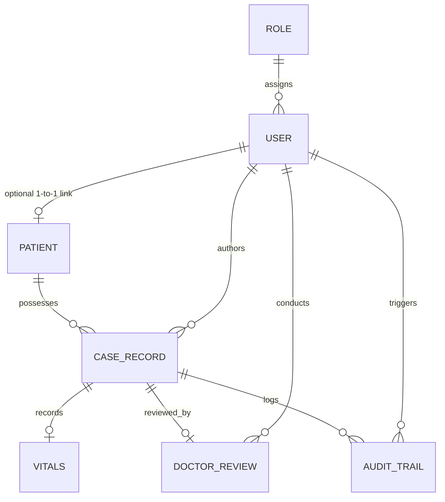

# Arogya — Comprehensive System & Technical Documentation

**Project Title**: Arogya — AI-Assisted Patient Case-Taking & Clinical Documentation Platform  
**Hackathon / Problem Statement**: Smart India Hackathon 2026 | Problem Statement SIH26047: *"Patient Case-Taking Software"*  
**Software Version**: `0.3.0` (Post-Phase 4C Stabilization)  
**Architecture**: Next.js 16 (App Router), React 19, TypeScript (Strict Mode), Tailwind CSS v4, Prisma ORM, PostgreSQL, Edge JWT Auth  
**Regulatory & Clinical Philosophy**: Designed for Indian clinical workflows with an interoperability-ready architecture (ABHA/UHID aligned, 10-section clinical history taxonomy, strict non-diagnostic AI boundary, mandatory physician approval, and dedicated patient health portal).

---

## Table of Contents

1. [Executive Summary & Clinical Philosophy](#1-executive-summary--clinical-philosophy)
2. [Complete Chronological Evolution: Step 0 to Step Last](#2-complete-chronological-evolution-step-0-to-step-last)
   - [Step 0: Problem Definition & Legacy Static Prototype](#step-0-problem-definition--legacy-static-prototype)
   - [Step 1: Architecture, Technology Stack & Domain Modeling (Phase 1)](#step-1-architecture-technology-stack--domain-modeling-phase-1)
   - [Step 2: Workstation Shell & Component Library (Phase 2)](#step-2-workstation-shell--component-library-phase-2)
   - [Step 3: Institutional Authentication, RBAC & Security (Phase 3)](#step-3-institutional-authentication-rbac--security-phase-3)
   - [Step 4: Runtime Stabilization & Next.js 16 Fixes](#step-4-runtime-stabilization--nextjs-16-fixes)
   - [Step 5: Visual & UI/UX Clinical Refinement](#step-5-visual--uiux-clinical-refinement)
   - [Step 6: Public Entry Experience & Landing Page (Phase 4A)](#step-6-public-entry-experience--landing-page-phase-4a)
   - [Step 7: Patient Role & Patient Portal (Phase 4B)](#step-7-patient-role--patient-portal-phase-4b)
   - [Step 8: Medicine Information Assistant (Phase 4C)](#step-8-medicine-information-assistant-phase-4c)
   - [Step 9: Manual Search Resolution & Prioritized Lookup Bug Fix (Phase 4C Fix)](#step-9-manual-search-resolution--prioritized-lookup-bug-fix-phase-4c-fix)
3. [Safety Invariants & Non-Diagnostic Clinical Boundaries](#3-safety-invariants--non-diagnostic-clinical-boundaries)
4. [Source-Aligned 10-Section Clinical Case Taxonomy](#4-source-aligned-10-section-clinical-case-taxonomy)
5. [Complete Database & Data Architecture (Prisma Schema)](#5-complete-database--data-architecture-prisma-schema)
   - [Enums](#enums)
   - [Data Models](#data-models)
   - [Entity-Relationship Diagram](#entity-relationship-diagram)
6. [Security, Authentication & Role-Based Access Control (RBAC)](#6-security-authentication--role-based-access-control-rbac)
   - [Edge Middleware Enforcement (`middleware.ts`)](#edge-middleware-enforcement-middlewarets)
   - [JWT Session Mechanics & Jose HS256 Token Structure](#jwt-session-mechanics--jose-hs256-token-structure)
   - [Dual Authentication Mode (`DEMO_MODE` vs Production PostgreSQL)](#dual-authentication-mode-demo_mode-vs-production-postgresql)
   - [Four-Role Matrix & Seeded Demo Accounts](#four-role-matrix--seeded-demo-accounts)
   - [Server-Side Authorization Guards](#server-side-authorization-guards)
   - [Server-Side Data Ownership Guard](#server-side-data-ownership-guard)
7. [AI & Voice Abstraction Architecture](#7-ai--voice-abstraction-architecture)
   - [Decoupled LLM Provider Interface (`LLMProvider`)](#decoupled-llm-provider-interface-llmprovider)
   - [Decoupled Speech-to-Text Interface (`VoiceSTTProvider`)](#decoupled-speech-to-text-interface-voicesttprovider)
   - [Decoupled Medicine Information Provider (`MedicineInformationProvider`)](#decoupled-medicine-information-provider-medicineinformationprovider)
   - [Decoupled Medicine Explanation Provider (`MedicineExplanationProvider`)](#decoupled-medicine-explanation-provider-medicineexplanationprovider)
8. [Clinical Design System & Healthcare Tokens](#8-clinical-design-system--healthcare-tokens)
   - [Color Hierarchy & Semantic Tokens](#color-hierarchy--semantic-tokens)
   - [Typography & Monospace Rules](#typography--monospace-rules)
   - [Surfaces, Elevation & Borders](#surfaces-elevation--borders)
9. [Component Inventory & UI Primitives](#9-component-inventory--ui-primitives)
   - [Clinical Workstation Layout Components](#clinical-workstation-layout-components)
   - [Patient Portal Layout Components](#patient-portal-layout-components)
   - [UI Form & Display Primitives](#ui-form--display-primitives)
10. [Screen-by-Screen Architectural Breakdown](#10-screen-by-screen-architectural-breakdown)
    - [`/` (Public Arogya Landing Page)](#-public-arogya-landing-page)
    - [`/login` (Institutional Workstation & Patient Sign-In)](#login-institutional-workstation--patient-sign-in)
    - [`/dashboard` (Clinical Shift Workflow Dashboard)](#dashboard-clinical-shift-workflow-dashboard)
    - [`/cases/new` (Guided 5-Step Case-Taking Studio)](#casesnew-guided-5-step-case-taking-studio)
    - [`/review/queue` (Attending Doctor Verification Queue)](#reviewqueue-attending-doctor-verification-queue)
    - [`/review/[id]` (Attending Doctor Verification Console)](#reviewid-attending-doctor-verification-console)
    - [`/cases` (Longitudinal Encounters Directory)](#cases-longitudinal-encounters-directory)
    - [`/cases/[id]` (Encounter Summary Chart & EHR)](#casesid-encounter-summary-chart--ehr)
    - [`/patients` (Patient EHR Directory & Slide-out Profile)](#patients-patient-ehr-directory--slide-out-profile)
    - [`/patients/new` (Patient Demographic & Allergy Registration)](#patientsnew-patient-demographic--allergy-registration)
    - [`/activity` (Statutory Clinical Audit Trail)](#activity-statutory-clinical-audit-trail)
    - [`/settings` (Facility, AI Providers & Interoperability Settings)](#settings-facility-ai-providers--interoperability-settings)
    - [`/unauthorized` (Clinical Access Restricted Gateway)](#unauthorized-clinical-access-restricted-gateway)
    - [`/patient/dashboard` (Patient Self-Service Hub)](#patientdashboard-patient-self-service-hub)
    - [`/patient/records` (Patient Health Records Directory)](#patientrecords-patient-health-records-directory)
    - [`/patient/records/[id]` (Patient Consultation Summary Chart)](#patientrecordsid-patient-consultation-summary-chart)
    - [`/patient/profile` (Patient Identity & Demographic Profile)](#patientprofile-patient-identity--demographic-profile)
    - [`/patient/medicine-assistant` (Educational Medicine Information Assistant)](#patientmedicine-assistant-educational-medicine-information-assistant)
11. [API Contracts & Network Protocol](#11-api-contracts--network-protocol)
    - [`POST /api/auth/login`](#post-apiauthlogin)
    - [`POST /api/auth/logout`](#post-apiauthlogout)
    - [`GET /api/auth/me`](#get-apiauthme)
    - [`POST /api/review/approve`](#post-apireviewapprove)
    - [`GET /api/admin/users`](#get-apiadminusers)
    - [`GET /api/patient/records`](#get-apipatientrecords)
    - [`POST /api/patient/medicine-assistant`](#post-apipatientmedicine-assistant)
12. [Verification, Quality Assurance & Test Matrix](#12-verification-quality-assurance--test-matrix)
    - [Phase 4B Test Suite: 30 / 30 Tests](#phase-4b-test-suite-30--30-tests)
    - [Phase 4C Test Suite: 42 / 42 Tests](#phase-4c-test-suite-42--42-tests)
13. [Directory Tree & Complete File Manifest](#13-directory-tree--complete-file-manifest)
14. [Operational Runbook & Installation Guide](#14-operational-runbook--installation-guide)

---

## 1. Executive Summary & Clinical Philosophy

In outpatient departments (OPDs), primary health centers (PHCs), and tertiary public hospitals across India, doctors routinely treat between 80 and 120 patients per shift. Under this extreme pressure, clinicians have mere minutes per encounter. The administrative overhead of manual note-taking leads to illegible handwriting, incomplete medical histories, unrecorded drug hypersensitivities, and physician burnout.

**Arogya** was engineered under **Smart India Hackathon 2026 (Problem Statement SIH26047: "Patient Case-Taking Software")** as a resilient, high-speed clinical workstation designed specifically for the realities of Indian healthcare.

### Core Architectural Principles
1. **Assistive, Non-Diagnostic Boundary**: Artificial intelligence assists solely with transcript formatting, extracting clinical entities, and structuring notes into standardized sections. The software never independently generates a medical diagnosis or treatment plan.
2. **Clinician in Direct Control**: No clinical encounter record is ever committed or archived into the permanent longitudinal medical record without explicit verification and approval by a licensed medical practitioner (`DOCTOR` role).
3. **Ergonomic, Glare-Reducing UI**: Engineered for high-density, multi-hour clinical shifts using a calm healthcare palette (deep clinical teal `#0F766E`, warm clinical canvas `#F8FAFB`, crisp slate typography) with zero distracting consumer AI tropes (no purple neon glows, floating robot heads, or chatbot bubbles).
4. **Interoperability-Ready**: Aligned with Indian healthcare standards (Ayushman Bharat Digital Mission / ABDM), incorporating 14-digit ABHA IDs, Unique Healthcare Identifiers (UHID), state medical council registration numbers, and 10-section longitudinal encounter summaries.
5. **Patient Empowerment with Absolute Data Isolation**: Patients have direct, self-service access to their verified consultation records, documented allergies, and educational medicine guidance through a dedicated patient portal protected by strict server-side cryptographic ownership checks.

---

## 2. Complete Chronological Evolution: Step 0 to Step Last

```
┌────────────────────────┐     ┌────────────────────────┐     ┌────────────────────────┐
│        STEP 0          │     │        STEP 1          │     │        STEP 2          │
│ Legacy Static Prototype│ ──> │ Architecture & Prisma  │ ──> │ Component Library & UI │
│   (HTML / JS / CSS)    │     │   (Postgres / Models)  │     │  (AppShell / Primitives│
└────────────────────────┘     └────────────────────────┘     └────────────────────────┘
                                                                          │
┌────────────────────────┐     ┌────────────────────────┐                 │
│        STEP 5          │     │        STEP 4          │                 │
│ Visual Refinement & UX │ <── │ Runtime Stabilization  │ <───────────────┘
│ (Calm Clinical System) │     │ (AuthProvider Mount Fix│     ┌────────────────────────┐
└────────────────────────┘     └────────────────────────┘     │        STEP 3          │
            │                                                 │  Auth, RBAC & Security │
            ▼                                                 │  (JWT / Edge Middleware│
┌────────────────────────┐     ┌────────────────────────┐     └────────────────────────┘
│        STEP 6          │     │        STEP 7          │
│ Public Landing Page    │ ──> │ Patient Role & Portal  │
│ (Phase 4A Entry Flow)  │     │ (Phase 4B Isolation)   │
└────────────────────────┘     └────────────────────────┘
                                           │
                                           ▼
                               ┌────────────────────────┐     ┌────────────────────────┐
                               │        STEP 8          │     │        STEP 9          │
                               │ Medicine Assistant     │ ──> │ Manual Input Bug Fix   │
                               │ (Phase 4C Architecture)│     │ (42/42 Tests Passing)  │
                               └────────────────────────┘     └────────────────────────┘
```

### Step 0: Problem Definition & Legacy Static Prototype
- **Origin**: Problem Statement SIH26047 for Smart India Hackathon 2026.
- **Initial Codebase**: Located in `/legacy-prototype/` (`index.html`, `app.js`, `styles.css`).
- **Capabilities & Deficiencies**:
  - Captured client-side input with a naive quality indicator.
  - Mock voice button injected a hardcoded clinical transcript snippet into a textarea.
  - Formatted notes via client-side template literal string concatenation.
  - Zero server runtime, zero database, zero authentication, no audit trails, and data lost on refresh.

### Step 1: Architecture, Technology Stack & Domain Modeling (Phase 1)
- **Framework Upgrade**: Built on Next.js 16 (App Router), React 19, TypeScript strict mode, and Tailwind CSS v4.
- **Data Persistence**: Configured PostgreSQL database via Prisma ORM (`prisma/schema.prisma`), defining models for users, sessions, patients, clinical cases, doctor reviews, vitals, audit trails, and facility settings.
- **10-Section History Taxonomy**: Defined standard clinical contracts (`src/types/clinical.ts`, `src/types/patient.ts`).
- **Decoupled Engine Abstractions**: Created `LLMProvider` (`MockClinicalLLMProvider`) and `VoiceSTTProvider` (`MockVoiceSTTProvider`) to support pluggable on-premise models (e.g. Ollama, Whisper) without vendor lock-in.

### Step 2: Workstation Shell & Component Library (Phase 2)
- **Workstation Layout**: Built `AppShell`, `AppSidebar`, `AppHeader`, `PageHeader`, and `SectionHeader`.
- **Component Primitives**: Created 20+ accessible UI primitives in `src/components/ui/` (`Card`, `Button`, `Input`, `Select`, `Badge`, `StatusBadge`, `DataTable`, `Drawer`, `Modal`, `ConfirmationDialog`, `Stepper`, `Tabs`).
- **Clinical Consoles**: Built guided 5-step case intake studio, 2-column doctor review console, patient EHR directory, and audit logs.

### Step 3: Institutional Authentication, RBAC & Security (Phase 3)
- **Cryptographic JWT Engine**: Built `jose` HS256 symmetric signing with 8-hour shift lifespan stored in secure `httpOnly` cookies (`arogya_session`).
- **Edge Middleware (`src/middleware.ts`)**: Built edge-level route protection and role-based access control.
- **Initial RBAC Hierarchy**: Established `DOCTOR`, `CLINICAL_STAFF`, and `ADMINISTRATOR` roles with granular permission mappings.
- **Dual-Mode Operation**: `DEMO_MODE=true` runs out-of-the-box with in-memory seeded demo credentials; `DEMO_MODE=false` executes production PostgreSQL Prisma queries with PBKDF2/bcrypt salted hashes.

### Step 4: Runtime Stabilization & Next.js 16 Fixes
- **AuthProvider Fix**: Resolved `/login` runtime crash (`Error: useAuth must be used within an AuthProvider`) by wrapping `src/app/layout.tsx` in `AuthProvider`.
- **Async Route Params**: Updated dynamic route parameters to comply with Next.js 16 requirements (`const { id } = await params`).

### Step 5: Visual & UI/UX Clinical Refinement
- **Elimination of Fake Claims**: Replaced unsupported claims (AIIMS approved, ABDM compliant, digital cryptographic signatures) with accurate technical descriptions: *"Designed for Indian clinical workflows with an interoperability-ready architecture."*
- **Preserved Approval Model**: Standardized action as *"Approve Case"* and status as *"Clinician Approved"*.
- **Objective Physiological Vitals**: Displayed vitals objectively without automated clinical decision support (CDS) or artificial alerts.
- **Glare-Reducing Aesthetics**: Shifted away from consumer AI tropes to a high-density, calm clinical tool.

### Step 6: Public Entry Experience & Landing Page (Phase 4A)
- **Public Entry Experience**: Converted root route `/` from an automatic redirect into an informative public landing page.
- **Architecture**:
  ```
  / (Public Home) ──► /login (Institutional Sign-In) ──► Role-Based Portal
  ```
- **Sections**: Clinical hero section, step-by-step workflow overview, role access cards, trust & safety principles, and a live preview card of Case `#AR-2026-0041` in `General OPD • Room 104`.
- **Edge Middleware Whitelist**: Whitelisted `/` as a public route while maintaining full protection on clinical modules.

### Step 7: Patient Role & Patient Portal (Phase 4B)
- **Fourth Role (`PATIENT`)**: Extended `RoleType` enum in `prisma/schema.prisma` and auth types.
- **1-to-1 Schema Link**: Associated `User` with `Patient` (`User.patientProfileId` $\leftrightarrow$ `Patient.user`).
- **Session Payload**: Added `patientId` to JWT payload and session user object.
- **Dynamic Routing**:
  - `PATIENT` $\to$ `/patient/dashboard`
  - `DOCTOR`, `CLINICAL_STAFF`, `ADMINISTRATOR` $\to$ `/dashboard`
- **Patient Shell & Portal**: Created `PatientShell`, `/patient/dashboard`, `/patient/records`, `/patient/records/[id]`, `/patient/profile`.
- **Server-Side Data Ownership**: Built strict ownership checks preventing patients from accessing foreign records or clinician modules (`/review/*`, `/cases`, `/settings`, etc.).
- **Automated Test Suite**: Verified with 30/30 tests in `scratch/test-phase-4b.mjs`.

### Step 8: Medicine Information Assistant (Phase 4C)
- **Active Educational Assistant**: Transformed `/patient/medicine-assistant` from a placeholder into a functional educational tool.
- **Architectural Flow**:
  ```
  Medicine Name ──► Trusted Knowledge Base ──► AI Explanation Layer ──► Patient Result
  ```
- **Controlled Knowledge Base**: Curated reference data for Paracetamol, Ibuprofen, Cetirizine, Amoxicillin, Omeprazole, and their brand aliases.
- **Non-Diagnostic Safety Disclaimer**: Mandatory notice: *"This information is provided for educational purposes and does not replace advice from a doctor or pharmacist. Do not start, stop, or change a medicine based only on this information."*
- **Safe Not-Found State**: Unknown medicines safely return `found: false` without LLM guessing.
- **Dedicated Endpoint**: `POST /api/patient/medicine-assistant` enforcing `PATIENT` role and input validation.

### Step 9: Manual Search Resolution & Prioritized Lookup Bug Fix (Phase 4C Fix)
- **Identified Root Cause**: Unbounded substring matching (`aliasNorm.includes(normalized)`) in `provider.ts` caused partial queries to collide with Paracetamol's aliases. Lack of a `<form>` element in `page.tsx` caused inconsistent submission behavior.
- **5-Stage Prioritized Lookup**:
  1. Exact Primary Name Match (case-insensitive)
  2. Exact Alias Match (case-insensitive)
  3. Exact Generic Name Match
  4. Word-Boundary Match in Generic Name
  5. Whole-Word Token Match in Query
  6. Default: Return `null` (safe not-found state, zero hallucination)
- **Form Submission Architecture**: Wrapped search bar in `<form onSubmit={handleFormSubmit}>` with `type="submit"`. Enforced input state as the strict source of truth for manual searches.
- **Verification & Test Suite Expansion**: Expanded `scratch/test-phase-4c.mjs` to **42 / 42 automated tests**, including 12 dedicated typed medicine accuracy and cross-medicine isolation tests.

---

## 3. Safety Invariants & Non-Diagnostic Clinical Boundaries

Arogya enforces strict regulatory safety invariants:

```
┌────────────────────────────────────────────────────────────────────────┐
│                   CLINICAL SAFETY BOUNDARIES IN AROGYA                 │
├────────────────────────────────┬───────────────────────────────────────┤
│ WHAT AROGYA DOES               │ WHAT AROGYA NEVER DOES                │
├────────────────────────────────┼───────────────────────────────────────┤
│ Transcribes audio into text    │ Generate automatic medical diagnoses  │
│ Parses messy notes into sections│ Prescribe drugs or altered dosages    │
│ Extracts symptoms & allergies  │ Override a clinician's judgment       │
│ Explains verified medicine data│ Hallucinate unknown medicines         │
│ Highlights documented allergies│ Lock a record without doctor approval │
│ Displays objective vitals      │ Auto-triage patients into danger tiers│
└────────────────────────────────┴───────────────────────────────────────┘
```

1. **Non-Diagnostic AI Boundary**: The structuring engine and medicine assistant operate strictly as information formatting aids. They never diagnose conditions or recommend treatment changes.
2. **Mandatory Physician Approval**: Case records cannot transition from `UNDER_REVIEW` to `FINALIZED` without direct approval by a licensed medical practitioner (`DOCTOR`).
3. **Immutable Clinical Audit Trail**: Sign-in events, case drafting, structuring requests, note modifications, and approvals are logged in `AuditTrail` with timestamps, actor IDs, and IP addresses.
4. **Isolated Patient Privacy**: The Medicine Assistant operates completely independent of patient case files. No clinical history, diagnoses, or notes are sent to the medicine assistant API.

---

## 4. Source-Aligned 10-Section Clinical Case Taxonomy

All patient encounters are structured according to standard clinical case-taking taxonomy:

| # | Section | Description & Field Content |
| :---: | :--- | :--- |
| **1** | **Presenting Complaint (Chief Complaint)** | Primary reason for consultation, stated with onset and duration (e.g., *"Chest tightness and dry cough for 3 days"*). |
| **2** | **History of Present Illness (HPI)** | Chronological narrative: anatomical location, onset, character, severity (1-10), aggravating/relieving factors, and associated systemic symptoms. |
| **3** | **Past Medical History (PMH)** | Pre-existing chronic illnesses (Hypertension, T2DM, Asthma, IHD, CKD, Tuberculosis). |
| **4** | **Past Surgical History (PSH)** | Prior surgeries, major trauma, dates, and anesthesia history. |
| **5** | **Drug History (Current Medications)** | Ongoing prescription drugs, OTC remedies, Ayurvedic/Homeopathic medications, dosages, and compliance. |
| **6** | **Allergy History** | Documented adverse reactions (Penicillin, NSAIDs, Sulfa, contrast media) with alert banners across all clinical views. |
| **7** | **Family History** | Hereditary diseases among first-degree relatives (early MI, diabetes, stroke, malignancies). |
| **8** | **Personal & Social History** | Occupation, smoking pack-years, alcohol intake, dietary pattern, and sanitation conditions. |
| **9** | **Review of Systems (ROS)** | Multi-system inquiry: General, CVS, Respiratory, GI, Neuro, Musculoskeletal, Genitourinary, Dermatological. |
| **10** | **Objective Vitals & Clinician Review** | Physiological vitals (BP, Pulse, SpO₂, Temp, RR), attending physician impression, amendments, and sign-off. |

---

## 5. Complete Database & Data Architecture (Prisma Schema)

The database schema is managed via **Prisma ORM** (`prisma/schema.prisma`) targeting **PostgreSQL**.

### Enums

#### `RoleType`
- `DOCTOR`: Attending physician with clinical review, modification, and approval permissions.
- `CLINICAL_STAFF`: Nurses and triage staff who conduct case intake and record vitals.
- `ADMINISTRATOR`: Hospital administrators managing users, settings, and audit trails.
- `PATIENT`: Registered patient accessing their own health records and educational medicine assistant.

#### `CaseStatus`
- `DRAFT` | `AI_STRUCTURED` | `UNDER_REVIEW` | `FINALIZED` | `AMENDED`

#### `Gender`
- `MALE` | `FEMALE` | `OTHER` | `UNKNOWN`

#### `SeverityLevel`
- `LOW` | `MODERATE` | `HIGH` | `CRITICAL`

---

### Data Models

#### 1. `User` (Table: `users`)
- `id` (`String`, `@id`, `@default(cuid())`): Unique user identifier.
- `email` (`String`, `@unique`): Login email address.
- `name` (`String`): Full user name.
- `passwordHash` (`String`): Salted PBKDF2 password hash.
- `roleId` (`String`): Foreign key referencing `roles.id`.
- `patientProfileId` (`String?`, `@unique`): Optional 1-to-1 foreign key linking `User` to `Patient`.
- `patientProfile` (`Patient?`): Optional 1-to-1 relation to `Patient`.
- `specialty` (`String?`), `licenseNumber` (`String?`), `department` (`String?`), `isActive` (`Boolean`).
- Relations: `authoredCases`, `reviewedCases`, `approvedCases`, `auditActions`, `sessions`.

#### 2. `Patient` (Table: `patients`)
- `id` (`String`, `@id`, `@default(cuid())`): Unique patient ID.
- `uhid` (`String`, `@unique`): Hospital Unique Healthcare Identifier (e.g. `AIIMS-2026-0941`).
- `abhaId` (`String?`, `@unique`): 14-digit ABDM ABHA ID (e.g. `91-4821-3920-1102`).
- `fullName` (`String`), `dateOfBirth` (`DateTime`), `gender` (`Gender`), `bloodGroup` (`String?`).
- `phone` (`String?`), `email` (`String?`), `address` (`String?`), `emergencyContact` (`Json?`).
- `knownAllergies` (`String[]`), `chronicConditions` (`String[]`).
- `user` (`User?`): Back-relation linking `Patient` to their `User` login account.
- Relations: `cases` (`CaseRecord[]`).

#### 3. `CaseRecord` (Table: `cases`)
- `id` (`String`, `@id`, `@default(cuid())`): Unique encounter ID.
- `caseNumber` (`String`, `@unique`): Human-readable identifier (e.g. `AR-2026-0041`).
- `patientId` (`String`): Foreign key referencing `patients.id`.
- `authorId` (`String`): Foreign key referencing `users.id`.
- `status` (`CaseStatus`): Current lifecycle state.
- `chiefComplaint` (`String`): Presenting symptom.
- `rawNotes` (`String`), `voiceTranscript` (`String?`).
- `structuredData` (`Json?`): The 10 structured clinical history sections.
- Relations: `vitals` (`Vitals?`), `doctorReview` (`DoctorReview?`), `auditLogs` (`AuditTrail[]`).

#### 4. `Vitals` (Table: `vitals`)
- `systolicBp`, `diastolicBp`, `heartRate`, `respiratoryRate`, `temperature`, `spo2`, `bloodGlucose`.

#### 5. `DoctorReview` (Table: `doctor_reviews`)
- `caseId` (`String`, `@unique`), `reviewerId` (`String`), `approvedById` (`String?`), `clinicalSummary` (`String`), `prescriptions` (`Json?`), `reviewedAt` (`DateTime`).

#### 6. `AuditTrail` (Table: `audit_trails`)
- `id`, `action`, `entityType`, `entityId`, `actorId`, `ipAddress`, `timestamp`, `details`.

---

### Entity-Relationship Diagram



---

## 6. Security, Authentication & Role-Based Access Control (RBAC)

### Edge Middleware Enforcement (`src/middleware.ts`)
The Edge Middleware verifies sessions before any request hits server components or API handlers:
1. **Public Routes**: `/`, `/login`, `/unauthorized`, and `/api/auth/login` bypass session requirements.
2. **Clinician Isolation**: Authenticated `PATIENT` users attempting to access `/dashboard`, `/cases/*`, `/review/*`, `/patients/*`, `/activity`, `/settings`, or `/admin/*` are intercepted and redirected to `/unauthorized`.
3. **Patient Route Protection**: Authenticated `DOCTOR`, `CLINICAL_STAFF`, or `ADMINISTRATOR` users attempting to access `/patient/*` or `/api/patient/*` are blocked (`307` redirect to `/unauthorized` for pages, `403 Forbidden` for API routes).
4. **Smart Login Redirection**: Authenticated `PATIENT` users visiting `/login` are automatically routed to `/patient/dashboard`; clinicians are routed to `/dashboard`.

### JWT Session Mechanics (`src/lib/auth/jwt.ts`)
- **Algorithm**: `HS256` symmetric signing via `jose`.
- **Secret**: `JWT_SECRET` environment variable (minimum 32 characters).
- **Cookie Configuration**:
  ```ts
  {
    name: "arogya_session",
    httpOnly: true,
    secure: process.env.NODE_ENV === "production",
    sameSite: "lax",
    path: "/",
    maxAge: 28800 // 8 hours (standard clinical shift)
  }
  ```
- **JWT Payload**:
  ```json
  {
    "sub": "usr-patient-101",
    "email": "patient@arogya.gov.in",
    "name": "Rajesh Gupta",
    "role": "PATIENT",
    "patientId": "pat-101",
    "permissions": ["patient:records:view", "patient:profile:view"],
    "exp": 1773700000
  }
  ```

---

### Four-Role Matrix & Seeded Demo Accounts

| Role | Demo Email | Password | Scope & Authority |
|---|---|---|---|
| **`DOCTOR`** | `doctor@arogya.gov.in` | `Doctor@Arogya2026` | Full clinical review, case editing, case approval, review queue. |
| **`CLINICAL_STAFF`** | `staff@arogya.gov.in` | `Staff@Arogya2026` | Patient registration, vitals recording, 5-step case intake drafting. |
| **`ADMINISTRATOR`** | `admin@arogya.gov.in` | `Admin@Arogya2026` | User management, audit logs, system configuration. |
| **`PATIENT`** | `patient@arogya.gov.in` | `Patient@Arogya2026` | Self-service access to own consultation records, profile, and medicine assistant. |

---

### Server-Side Data Ownership Guard
In addition to Edge Middleware, server-side page and API handlers enforce strict record-level ownership:
- **`src/app/patient/records/[id]/page.tsx`**:
  ```ts
  if (caseRecord.patientId !== sessionUser.patientId) {
    redirect("/patient/records");
  }
  ```
- **`src/app/api/patient/records/route.ts`**:
  Derives `patientId` strictly from `auth.user.patientId`, completely ignoring any client-supplied parameters.

---

## 7. AI & Voice Abstraction Architecture

```
┌─────────────────────────────────────────────────────────────┐
│                 Arogya AI & Voice Architecture              │
├──────────────────────────────┬──────────────────────────────┤
│ Provider Interface           │ Implementation               │
├──────────────────────────────┼──────────────────────────────┤
│ LLMProvider                  │ MockClinicalLLMProvider      │
│ VoiceSTTProvider             │ MockVoiceSTTProvider         │
│ MedicineInformationProvider  │ LocalTrustedMedicineProvider │
│ MedicineExplanationProvider  │ StandardMedicineExplanation  │
└──────────────────────────────┴──────────────────────────────┘
```

### Decoupled Abstractions
1. **`LLMProvider` (`src/lib/ai/provider.ts`)**:
   Structures raw unstructured intake notes into the 10 standardized clinical sections. Reversible and non-diagnostic.
2. **`VoiceSTTProvider` (`src/lib/voice/provider.ts`)**:
   Transcribes medical audio into clinical text without cloud dependency.
3. **`MedicineInformationProvider` (`src/lib/medicine/provider.ts`)**:
   Decouples medicine knowledge sourcing. Implements strict 5-stage prioritized matching against curated reference data.
4. **`MedicineExplanationProvider` (`src/lib/medicine/explanation-service.ts`)**:
   Translates verified reference records into plain-language educational summaries. Injects mandatory safety disclaimers and strictly prevents hallucinations.

---

## 8. Clinical Design System & Healthcare Tokens

Located in `src/lib/tokens/design-tokens.ts`:
- **Primary Clinical Teal (`#0F766E`)**: High-trust, professional healthcare hue providing authority and focus.
- **Canvas (`#F8FAFB`)**: Glare-reducing warm clinical neutral minimizing eye strain during 8-hour shifts.
- **Surface Elevation**: Clean borders (`border-slate-200/90`) with soft micro-shadows (`shadow-2xs`), avoiding distracting glassmorphism.
- **Monospace Numbering**: Strict monospace font for physiological vitals, ABHA IDs, case numbers, and dates.

---

## 9. Component Inventory & UI Primitives

### Clinical Workstation Layout Components
- **`AppShell` (`src/components/layout/app-shell.tsx`)**: Responsive workstation container with sidebar and topbar.
- **`AppSidebar` (`src/components/layout/app-sidebar.tsx`)**: Role-aware clinical navigation with active indicators.
- **`AppHeader` (`src/components/layout/app-header.tsx`)**: Shift identity chip, facility context, and logout.

### Patient Portal Layout Components
- **`PatientShell` (`src/components/patient/patient-shell.tsx`)**: Dedicated patient navigation bar with active tab indicators (Dashboard, My Records, Profile, Medicine Assistant), patient identity badge, and sign-out button.

### UI Form & Display Primitives (`src/components/ui/`)
- `Button`, `Input`, `Select`, `Badge`, `Card`, `StatusBadge`, `DataTable`, `Drawer`, `Modal`, `ConfirmationDialog`, `Tabs`, `Stepper`.

---

## 10. Screen-by-Screen Architectural Breakdown

### 1. `/` (Public Arogya Landing Page)
- **Role**: Public Discovery & Entry Point.
- **Features**: Brand wordmark, clinical positioning, 5-step how-it-works overview, key benefits, 4-role access breakdown, trust & safety principles, live preview card of Case `#AR-2026-0041` in `General OPD • Room 104`.

### 2. `/login` (Institutional Workstation & Patient Sign-In)
- **Role**: Unified Authentication.
- **Features**: 4 Quick Demo Account buttons (Doctor, Staff, Admin, Patient), credential fields, security notice. Dynamically redirects to `/patient/dashboard` or `/dashboard`.

### 3. `/dashboard` (Clinical Shift Workflow Dashboard)
- **Role**: Clinician Command Center.
- **Features**: Shift metrics (total cases, awaiting review, finalized), active encounter queue, quick action shortcuts.

### 4. `/cases/new` (Guided 5-Step Case-Taking Studio)
- **Role**: Patient Intake & History Capture (`CLINICAL_STAFF`).
- **Features**: 5-step stepper (Patient Identification $\to$ Chief Complaint $\to$ Structured History $\to$ Physiological Vitals $\to$ AI Structuring Review).

### 5. `/review/queue` (Attending Doctor Verification Queue)
- **Role**: Clinician Triage (`DOCTOR`).
- **Features**: Filterable queue of cases in `AI_STRUCTURED` status awaiting verification.

### 6. `/review/[id]` (Attending Doctor Verification Console)
- **Role**: Clinical Sign-Off Console (`DOCTOR`).
- **Features**: 2-column layout (Intake history on left, doctor verification and notes on right), explicit *"Approve Case"* action.

### 7. `/cases` & `/cases/[id]` (Encounters Directory & Chart)
- **Role**: Longitudinal EHR Directory.
- **Features**: Searchable table of all encounters, detailed case view with history sections and vitals.

### 8. `/patients` & `/patients/new` (Patient Directory & Registration)
- **Role**: Patient Master Index.
- **Features**: Searchable patient table with slide-out preview drawer, registration form capturing ABHA ID, UHID, and allergies.

### 9. `/activity` (Statutory Clinical Audit Trail)
- **Role**: Audit & Compliance (`ADMINISTRATOR`).
- **Features**: Immutable log of user sign-ins, case drafts, AI structuring requests, and approvals.

### 10. `/settings` (Facility Configuration)
- **Role**: System Administration (`ADMINISTRATOR`).
- **Features**: Facility name, OPD rooms, active AI provider configuration, and ABDM interoperability parameters.

### 11. `/unauthorized` (Clinical Access Restricted Gateway)
- **Role**: Security Interception Screen.
- **Features**: Clear restriction notice, required role indicator, and return button to user's authorized home.

### 12. `/patient/dashboard` (Patient Self-Service Hub)
- **Role**: Patient Command Center (`PATIENT`).
- **Features**: Welcome banner, health stats, documented allergy alert box, recent clinical encounters table, demographic card, and active Medicine Assistant card.

### 13. `/patient/records` & `/patient/records/[id]` (Patient Records Directory & Summary)
- **Role**: Patient Health Chart (`PATIENT`).
- **Features**: Searchable directory of patient's own consultation records. Detail view displays presenting complaint, structured history, objective vitals, and attending doctor's notes. Enforces strict server-side ownership.

### 14. `/patient/profile` (Patient Identity & Demographic Profile)
- **Role**: Patient Health Identity (`PATIENT`).
- **Features**: Full name, DOB, Age, Gender, Blood Group, UHID (`AIIMS-2026-0941`), ABHA ID (`91-4821-3920-1102`), emergency contact, known allergies, and baseline vitals.

### 15. `/patient/medicine-assistant` (Educational Medicine Information Assistant)
- **Role**: Patient Educational Search (`PATIENT`).
- **Features**: Accessible search input with standard form submission, suggested medicine chips (Paracetamol, Ibuprofen, Cetirizine, Amoxicillin, Omeprazole), loading state, structured educational result card (What is it?, Common uses, How it is used, Precautions, Side effects, When to contact a doctor), mandatory educational safety banner, and safe not-found state for unknown medicines.

---

## 11. API Contracts & Network Protocol

### `POST /api/auth/login`
- **Body**: `{ "email": "...", "password": "..." }`
- **Response**: Sets `arogya_session` cookie; returns `{ success: true, user: SessionUser }`.

### `POST /api/auth/logout`
- **Response**: Deletes session cookie; returns `{ success: true }`.

### `GET /api/auth/me`
- **Response**: Returns current authenticated `SessionUser` or 401.

### `POST /api/review/approve`
- **Authorization**: `DOCTOR` role only.
- **Body**: `{ "caseId": "...", "clinicalSummary": "...", "prescriptions": [...] }`
- **Response**: Transitions case status to `FINALIZED`.

### `GET /api/patient/records`
- **Authorization**: `PATIENT` role only.
- **Behavior**: Scopes records strictly to `session.patientId`.
- **Response**: `{ success: true, patient: { ... }, records: [...], count: N }`.

### `POST /api/patient/medicine-assistant`
- **Authorization**: `PATIENT` role only.
- **Body**: `{ "medicineName": "Paracetamol" }`
- **Validation**: Rejects non-string, empty, or $>100$ character queries with 400.
- **Response**:
  ```json
  {
    "success": true,
    "found": true,
    "searchedQuery": "Paracetamol",
    "data": {
      "medicineName": "Paracetamol",
      "genericName": "Paracetamol (Acetaminophen)",
      "category": "Analgesic & Antipyretic",
      "whatIsIt": "...",
      "commonUses": ["..."],
      "howItIsUsed": "...",
      "precautions": ["..."],
      "commonSideEffects": ["..."],
      "whenToContactDoctor": ["..."],
      "disclaimer": "This information is provided for educational purposes...",
      "explanationProvider": "Arogya-Educational-Explanation-Engine",
      "generatedAt": "2026-09-16T..."
    }
  }
  ```

---

## 12. Verification, Quality Assurance & Test Matrix

The Arogya platform is backed by two dedicated, non-overlapping automated test suites:

### Phase 4B Test Suite: 30 / 30 Tests (`scratch/test-phase-4b.mjs`)

| Category | Count | Scope |
|---|:---:|---|
| **1. Authentication** | 5 | Login route availability, unauthenticated redirects, credential verification, patient ID session mapping. |
| **2. Patient Access** | 4 | Patient access to `/patient/dashboard`, `/patient/records`, `/patient/profile`, `/patient/medicine-assistant`. |
| **3. Ownership / Security** | 3 | API scoping to `pat-101`, authorized case access (`case-2026-0041`), cross-patient case block (`case-2026-0042`). |
| **4. Role Isolation** | 9 | Patient blocked from clinician routes (6 tests); clinician blocked from patient portal; staff blocked from review; admin blocked from intake. |
| **5. Logout** | 1 | Cookie clearance and session termination. |
| **6. Non-Regression** | 8 | Public landing page, Doctor login & workstation, Staff intake, Admin settings. |
| **Total Phase 4B** | **30 / 30** | **100% Pass Rate** |

---

### Phase 4C Test Suite: 42 / 42 Tests (`scratch/test-phase-4c.mjs`)

| Category | Count | Scope |
|---|:---:|---|
| **A. Authentication** | 3 | Unauthenticated redirect, patient login, session cookie acceptance by medicine API. |
| **B. Patient Access** | 3 | Page access, valid search submission, structured response validation. |
| **C. Role Isolation** | 4 | Doctor/Staff/Admin blocked from page (`307`), non-patient blocked from API (`403`). |
| **D. Input Validation** | 3 | Empty query (400), malformed payload (400), $>100$ char query (400). |
| **E. Medicine Information** | 6 | Paracetamol, Ibuprofen, Cetirizine, Amoxicillin, Omeprazole, safe unknown medicine response (`found: false`). |
| **F. Safety Boundaries** | 4 | Educational disclaimer presence, non-diagnostic check, non-prescriptive check, client patientId spoofing rejection. |
| **G. Non-Regression** | 7 | Patient dashboard/records/profile accessible; Doctor dashboard/review accessible; Staff intake accessible; Admin settings accessible. |
| **H. Bug-Fix Verification** | 12 | Tests 31–42: Typed search accuracy (Paracetamol, Ibuprofen, Cetirizine, Amoxicillin, Omeprazole), alias searches (Dolo, Brufen, Cetzine), unknown medicine isolation, `searchedQuery` confirmation, and cross-medicine isolation. |
| **Total Phase 4C** | **42 / 42** | **100% Pass Rate** |

**Combined Automated Tests Executed: 72 / 72 Passing (100% Pass Rate)**

---

## 13. Directory Tree & Complete File Manifest

```
d:/Arogya_SIH26047_Website/
├── prisma/
│   └── schema.prisma                     # Complete database schema (User, Patient, Case, etc.)
├── public/
│   └── (static assets)
├── src/
│   ├── app/
│   │   ├── (auth)/
│   │   │   └── login/page.tsx            # Unified 4-role authentication screen
│   │   ├── (dashboard)/
│   │   │   ├── activity/page.tsx         # Statutory clinical audit trail
│   │   │   ├── cases/
│   │   │   │   ├── [id]/page.tsx         # Longitudinal encounter chart
│   │   │   │   ├── new/page.tsx          # 5-step guided intake studio
│   │   │   │   └── page.tsx              # Encounters directory
│   │   │   ├── dashboard/page.tsx        # Clinical shift command center
│   │   │   ├── layout.tsx                # Workstation AppShell wrapper
│   │   │   ├── patients/
│   │   │   │   ├── new/page.tsx          # Patient registration form
│   │   │   │   └── page.tsx              # Patient directory with slide-out preview
│   │   │   ├── review/
│   │   │   │   ├── [id]/page.tsx         # Attending doctor verification console
│   │   │   │   └── queue/page.tsx        # Doctor review queue
│   │   │   └── settings/page.tsx         # Facility configuration
│   │   ├── api/
│   │   │   ├── admin/users/route.ts      # User management API
│   │   │   ├── auth/
│   │   │   │   ├── login/route.ts        # Authentication & JWT issuance
│   │   │   │   ├── logout/route.ts       # Session cookie invalidation
│   │   │   │   └── me/route.ts           # Session verification
│   │   │   ├── patient/
│   │   │   │   ├── medicine-assistant/   # POST: Educational medicine lookup
│   │   │   │   │   └── route.ts
│   │   │   │   └── records/route.ts      # GET: Scoped patient encounters
│   │   │   └── review/approve/route.ts   # POST: Attending doctor case sign-off
│   │   ├── patient/
│   │   │   ├── dashboard/page.tsx        # Patient self-service hub
│   │   │   ├── layout.tsx                # Patient portal layout wrapper
│   │   │   ├── medicine-assistant/       # Educational medicine assistant UI
│   │   │   │   └── page.tsx
│   │   │   ├── profile/page.tsx          # Patient demographic & allergy profile
│   │   │   └── records/
│   │   │       ├── [id]/page.tsx         # Patient encounter summary (ownership guarded)
│   │   │       └── page.tsx              # Patient consultation records directory
│   │   ├── globals.css                   # Tailwind v4 clinical design tokens
│   │   ├── layout.tsx                    # Root application layout with AuthProvider
│   │   ├── page.tsx                      # Public Arogya landing page
│   │   └── unauthorized/page.tsx         # Access restricted gateway
│   ├── components/
│   │   ├── layout/
│   │   │   ├── app-header.tsx            # Clinician topbar
│   │   │   ├── app-shell.tsx             # Workstation layout container
│   │   │   └── app-sidebar.tsx           # Role-aware clinician sidebar
│   │   ├── patient/
│   │   │   └── patient-shell.tsx         # Patient portal topbar and navigation
│   │   ├── providers.tsx                 # Client-side AuthProvider mount
│   │   └── ui/                           # 20+ accessible UI primitives
│   ├── lib/
│   │   ├── ai/
│   │   │   ├── provider.ts               # LLM provider contract & mock
│   │   │   └── types.ts                  # AI structuring types
│   │   ├── auth/
│   │   │   ├── auth-context.tsx          # React useAuth client hook
│   │   │   ├── jwt.ts                    # Jose HS256 JWT operations
│   │   │   ├── repository.ts             # User credential verification
│   │   │   ├── server.ts                 # Server component auth guards
│   │   │   └── types.ts                  # Role definitions and permissions
│   │   ├── db/
│   │   │   └── prisma.ts                 # Global Prisma client singleton
│   │   ├── medicine/
│   │   │   ├── explanation-service.ts    # AI educational explanation layer
│   │   │   ├── knowledge-base.ts         # Curated reference database
│   │   │   ├── provider.ts               # 5-stage prioritized medicine lookup
│   │   │   └── types.ts                  # Medicine record and response types
│   │   ├── tokens/
│   │   │   └── design-tokens.ts          # Clinical design token constants
│   │   ├── voice/
│   │   │   ├── provider.ts               # Speech-to-Text provider abstraction
│   │   │   └── types.ts                  # Voice types
│   │   ├── mock-data.ts                  # Demo clinical data
│   │   └── utils.ts                      # Tailwind cn utility
│   ├── middleware.ts                     # Edge-level route protection & RBAC
│   └── types/
│       ├── clinical.ts                   # 10 clinical sections and vitals types
│       └── patient.ts                    # Patient profile types
└── scratch/
    ├── test-phase-4b.mjs                 # 30-assertion automated test suite
    └── test-phase-4c.mjs                 # 42-assertion automated test suite
```

---

## 14. Operational Runbook & Installation Guide

### Prerequisites
- **Node.js**: v18.18.0 or higher (Node v22+ LTS recommended)
- **npm**: v10.0.0 or higher
- **PostgreSQL**: Optional for local testing (`DEMO_MODE=true` runs out-of-the-box); required for production (`DEMO_MODE=false`).

### Setup & Launch

```bash
# 1. Install dependencies
npm install

# 2. Configure environment (DEMO_MODE=true by default)
cp .env.example .env

# 3. Generate Prisma client
npx prisma generate

# 4. Start development server
npm run dev
```

### Role Evaluation Walkthrough
Open `http://localhost:3000` in your browser:

1. **Public Landing Page**: Explore the entry experience at `/`. Click **"Get Started"** or **"Sign In"**.
2. **Doctor Persona (`doctor@arogya.gov.in`)**:
   - Click "Attending Doctor" quick-select on `/login`.
   - Review pending encounters in `/review/queue`.
   - Open Case `#AR-2026-0041` in `/review/[id]`, review intake notes, and click **"Approve Case"**.
3. **Clinical Staff Persona (`staff@arogya.gov.in`)**:
   - Click "Clinical Staff" quick-select on `/login`.
   - Navigate to `/cases/new` to test the 5-step clinical intake studio with simulated speech capture.
4. **Administrator Persona (`admin@arogya.gov.in`)**:
   - Click "Administrator" quick-select on `/login`.
   - Inspect the statutory audit trail at `/activity` and system settings at `/settings`.
5. **Patient Persona (`patient@arogya.gov.in`)**:
   - Click "Patient (Rajesh Gupta)" quick-select on `/login`.
   - Arrives at `/patient/dashboard` with health stats, allergies, and visits.
   - Click **"My Health Records"** (`/patient/records`) to view verified consultation summaries.
   - Click **"Medicine Assistant"** (`/patient/medicine-assistant`):
     - Manually type **"Paracetamol"** $\to$ returns verified Paracetamol data.
     - Manually type **"Ibuprofen"** $\to$ returns verified Ibuprofen data.
     - Manually type **"Dolo"** $\to$ resolves to Paracetamol.
     - Manually type **"NonExistentMedXYZ999"** $\to$ safe not-found state without hallucination.

### Verification Commands
```bash
# Strict TypeScript compilation check (0 errors)
npx tsc --noEmit

# Production build compilation (24 routes)
npm run build

# Automated test suites
node "C:\Users\Harsh Raj\.gemini\antigravity\brain\55cf6638-5673-40d1-9abd-e63134ebc1fc\scratch\test-phase-4b.mjs" # 30/30
node "C:\Users\Harsh Raj\.gemini\antigravity\brain\55cf6638-5673-40d1-9abd-e63134ebc1fc\scratch\test-phase-4c.mjs" # 42/42
```

---
*Arogya Platform Documentation • Smart India Hackathon 2026 (SIH26047)*  
*Engineered for Indian Clinical Workflows with an Interoperability-Ready Architecture.*
